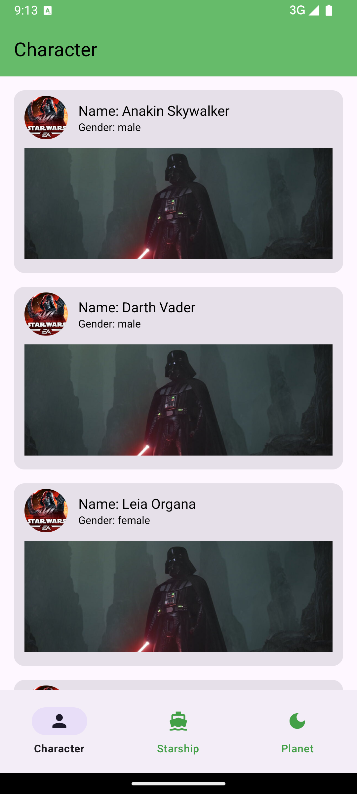
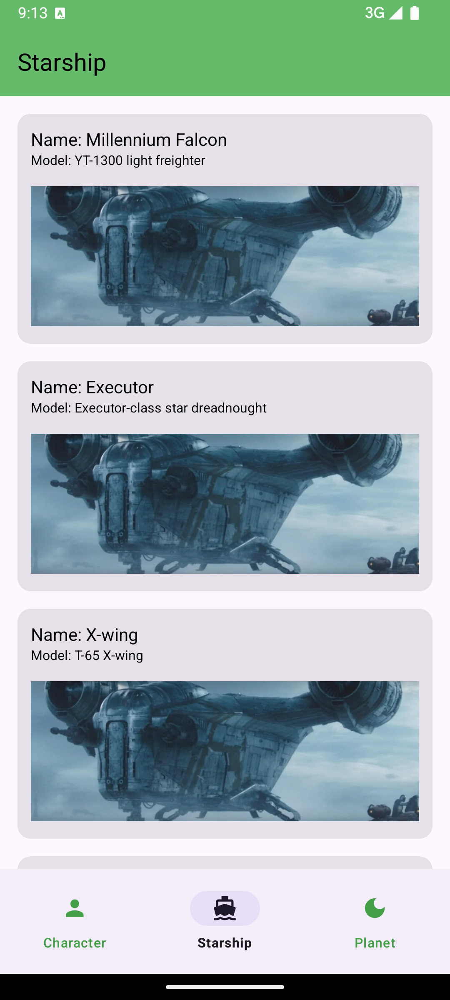
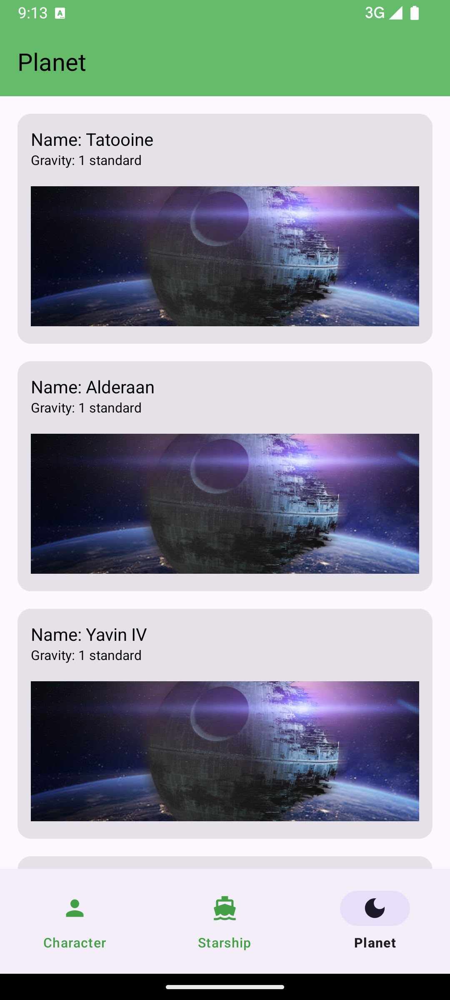
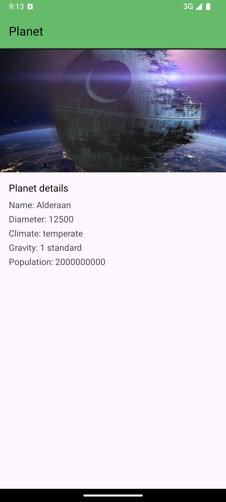

# StarWarsUniverse

Project for Reference

# 🌌 Star Wars Planets Explorer

**Tech Stack:** Kotlin · Clean Architecture · Multi-Module · Paging 3 · Navigation Component · Version Catalog · Convention Plugins

Explore a galaxy far, far away with the **Star Wars Planets Explorer** — an Android app that displays planets from the Star Wars universe using data from a public API.  
This project demonstrates modern Android development best practices and scalable architecture.

   

---

## 🔧 Features

- **Clean Architecture**  
  Layered architecture (`presentation`, `domain`, `data`) ensuring separation of concerns, testability, and scalability.

- **Multi-Module Structure**  
  Modularized project (`app`, `core`, `feature`, `common`, etc.) for better code isolation and faster build times.

- **Paging 3 Library**  
  Efficient infinite scroll with automatic data loading, error handling, and UI updates.

- **Navigation Component**  
  Simplified navigation and safe argument passing with support for nested navigation graphs.

- **Version Catalog**  
  Centralized dependency management using `libs.versions.toml` for better maintainability.

- **Convention Plugins**  
  Custom Gradle plugins to enforce consistent build configurations and reduce boilerplate.

---

## 🎯 Why This Project Matters

This project is not just a showcase of a sleek UI but also a practical implementation of **scalable, maintainable Android architecture**.  
It reflects real-world patterns and is designed to be a boilerplate or reference for larger projects.

---

## 🚀 Getting Started

Clone the project and open it in Android Studio Giraffe or later.  
Make sure you have Kotlin DSL support and Gradle version compatibility.

---

## 📬 Contact

Let’s connect on [LinkedIn](https://www.linkedin.com/in/sahinsafi/) or check out more projects [here](https://github.com/SahinSafi/).

